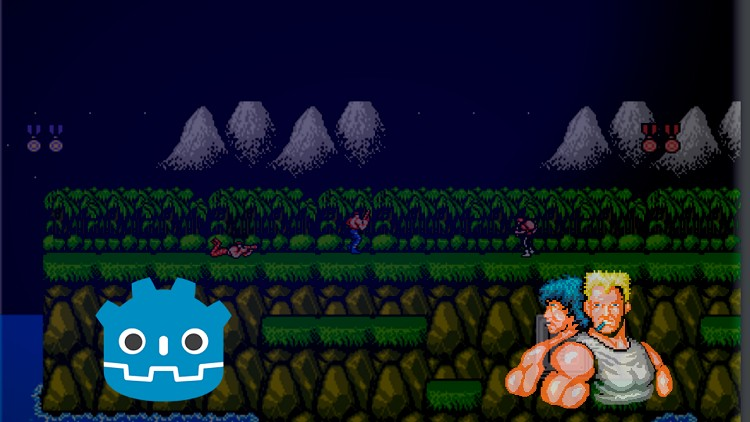

# Experto en Firebase para Android + MVP Curso Completo +30hrs

## Descripcion 

Curso tomado en la platafoma Udemy

https://www.udemy.com/course/como-crear-videojuegos-en-godot-3-el-contra/

El curso es impartido por Iki Capitan

## Galeria

## Lo que se aprendera 

- Crear Videojuegos con Godot Engine 3
- Recrear un Clásico de los Videojuegos
- Crear Tu Propio Juego de Plataformas
- Manipular Godot Engine 3
- Programar Scripts en Godot 3 (Lenguaje GDScript)
- Manipular Diferentes y Tipicos Algoritmos para el Desarrollo de Videojuegos
